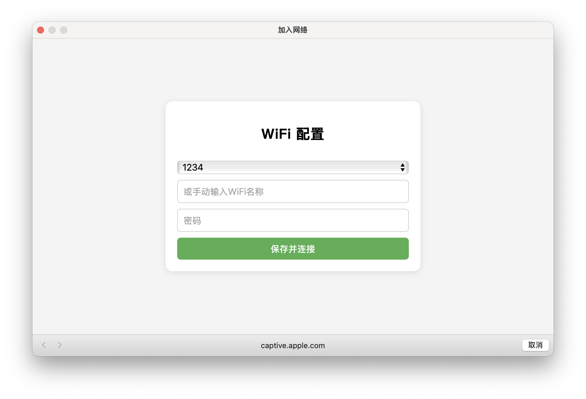

# ESP8266-CaptiveWiFiConfig

**🌐 Language**: [English](docs/README.us-en.md) | 简体中文

> A flexible and user-friendly WiFi configuration portal for ESP8266 with captive portal support, HTML UI, and EEPROM credential storage.

本项目提供了一个完整的基于 ESP8266 的 WiFi 配网系统，支持自动跳转的强制门户（Captive Portal）、WiFi 扫描、用户输入、EEPROM 保存配置等功能，适用于嵌入式设备的联网初始化配置。

---

## ✨ 功能特色

- ✅ 自动开启热点并重定向所有访问（Captive Portal）
- ✅ 支持扫描附近 WiFi 并下拉选择
- ✅ 可手动输入隐藏 WiFi 名称
- ✅ 表单提交后保存至 EEPROM 并重启连接
- ✅ 串口命令 `clear` 可清除已保存 WiFi 配置
- ✅ 兼容 Android / iOS / macOS / Windows 的网络检测机制
- ✅ 自动弹出 `WIFI` 配置页面
---

## 📷 页面示意图

- ✅ **macOS**


配网页面包括：
- WiFi 下拉列表（可点选）
- SSID 输入框（可手动输入或自动填入）
- 密码输入框
- 提交按钮

---

## 📦 使用说明

### 📌 硬件需求
- ESP8266 模块（NodeMCU, Wemos D1 Mini 等）
- PlatformIO 编译环境

### 🛠 编译步骤

克隆本仓库：
```bash
   git clone https://github.com/ExMikuPro/captive_portal.git
```